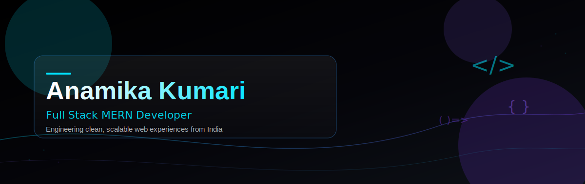

<!--
  README for github.com/Anamika01Kumari
  Place this file, plus the /assets folder (hero-banner.svg, footer-wave.svg),
  inside a repository named exactly "Anamika01Kumari" so GitHub renders it
  as the profile README. Replace placeholder project links before publishing.
-->

<div align="center">



<br/>


</div>

<br/>

<div align="center">
  
  
  
</div>

<br/>

<div align="center">
  
</div>

## ⌁ About

<table width="100%">
<tr>
<td>

I build full-stack products end to end — from schema design to pixel-level UI polish.
My focus is React and Node.js applications that stay fast, readable, and easy to extend.

I care more about **why** a system is built a certain way than about shipping something that merely works. Clean architecture is not optional to me — it's the default.

</td>
</tr>
</table>

<br/>

## ⌁ Current Focus

<table width="100%">
<tr>
<td width="33%" valign="top">

**🡢 Deepening the MERN Stack**
Advanced React patterns, state architecture, and performant Node.js APIs.

</td>
<td width="33%" valign="top">

**🡢 System Design**
Learning to structure scalable backends and clean data models.

</td>
<td width="33%" valign="top">

**🡢 Production-Grade UI**
Building interfaces with the same care as a shipped SaaS product.

</td>
</tr>
</table>

<br/>

## ⌁ Tech Stack

<table width="100%">
<tr><td><b>Languages</b></td></tr>
<tr><td>


</td></tr>

<tr><td><b>Frontend</b></td></tr>
<tr><td>


</td></tr>

<tr><td><b>Backend</b></td></tr>
<tr><td>


</td></tr>

<tr><td><b>Database</b></td></tr>
<tr><td>


</td></tr>

<tr><td><b>Cloud &amp; Deployment</b></td></tr>
<tr><td>


</td></tr>

<tr><td><b>Tools</b></td></tr>
<tr><td>


</td></tr>
</table>

<br/>

## ⌁ Featured Projects

<table width="100%">

<tr>
<td width="50%" valign="top">
<h3>Luxury Real Estate Platform</h3>
<p>Property listing platform with search filters, agent dashboard, and inquiry management.</p>
<p>


</p>
<p>
<a href="https://github.com/Anamika01Kumari/luxury-real-estate"></a>
<a href="#"></a>
</p>
</td>

<td width="50%" valign="top">
<h3>Job Portal</h3>
<p>Full-stack recruitment platform with role-based auth, job postings, and application tracking.</p>
<p>


</p>
<p>
<a href="https://github.com/Anamika01Kumari/job-portal"></a>
<a href="#"></a>
</p>
</td>
</tr>

<tr>
<td width="50%" valign="top">
<h3>Learning Management System</h3>
<p>Course delivery platform with student progress tracking, quizzes, and instructor dashboards.</p>
<p>


</p>
<p>
<a href="https://github.com/Anamika01Kumari/lms-platform"></a>
<a href="#"></a>
</p>
</td>

<td width="50%" valign="top">
<h3>Personal Portfolio</h3>
<p>Minimal, animation-driven portfolio built to showcase projects with a premium feel.</p>
<p>


</p>
<p>
<a href="https://github.com/Anamika01Kumari/portfolio"></a>
<a href="#"></a>
</p>
</td>
</tr>

</table>

<br/>

## ⌁ Activity

<div align="center">

</div>

<br/>

## ⌁ Developer Philosophy

<div align="center">

```
Simplicity is a design decision, not a shortcut.
Readable code today saves a rewrite tomorrow.
Ship with intention — not just to ship.
```

</div>

<br/>

## ⌁ Contact

<div align="center">

<a href="mailto:anamikakum9@gmail.com">

</a>
<a href="https://github.com/Anamika01Kumari">

</a>

</div>

<br/>

<div align="center">

</div>
